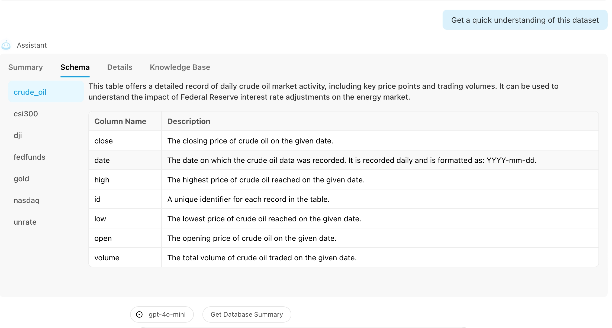
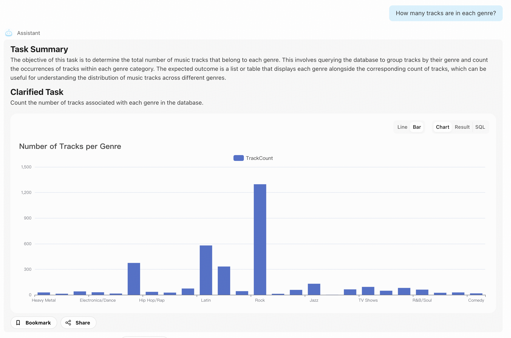
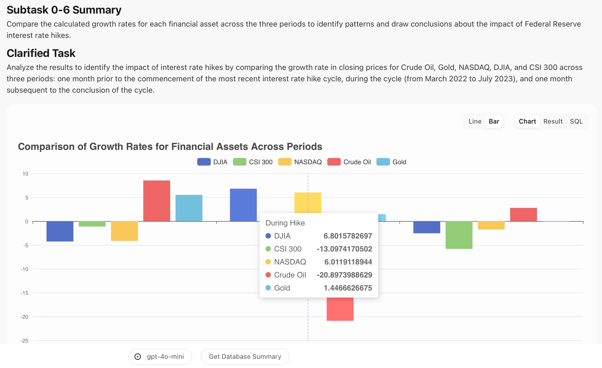
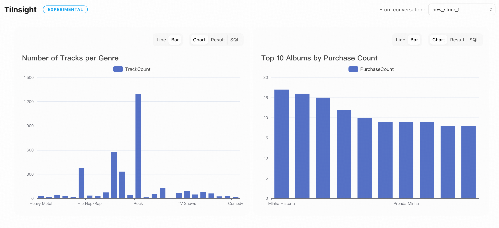
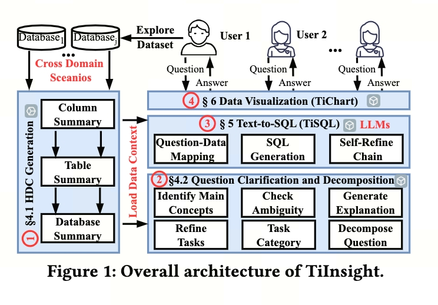

# TiInsight
In this data-driven era, every decision relies on accurate and rapid data analysis. However, data analysis often requires professional skills and complex tools, posing a significant challenge for many non-technical users.

TiInsight is an intelligent data analysis platform that allows users to conduct complex data queries and analysis through simple natural language. For those eager to see TiInsight in action without any setup, we offer an [online demo](https://www.tiinsight.chat/) for immediate exploration.

## Core Features
- **Conversational Interaction**: TiInsight enables users to interact with the platform as if they were having a conversation. The system intelligently understands user intent, executes data queries and analyses, and provides a seamless user experience.
- **Data Visualization**: TiInsight not only responds quickly to query requests but also presents results in intuitive visual formats, making data easier to understand and analyze.
- **Customizable Dashboards**: Users can integrate multiple query results into personalized dashboards using the bookmarking feature, creating custom data views tailored to individual or team needs.
- **Sharing and Collaboration**: TiInsight supports data result sharing, enhancing team collaboration efficiency. Team members can share and discuss data analysis results in real-time, regardless of their location.
- **Activity Logging**: TiInsight offers detailed operation history tracking, allowing users to easily review past data queries and analyses, facilitating troubleshooting and decision-making review.

Here are screenshots showing the main features of TiInsight. See how it makes data interaction easier and more efficient.







## Local Setup
For detailed instructions on how to set up the project locally, please refer to [SETUP.md](./SETUP.md).


## Technology Behind TiInsight
TiInsight is driven by **Chat2Query**, an innovative tool developed by [TiDB Cloud](https://tidbcloud.com/). Chat2Query utilizes the capabilities of Large Language Models (LLMs) to enable users to explore and interact with databases through natural language, **achieving industry-leading accuracy**. With OpenAPI support, it can be seamlessly integrated into your business systems, allowing for a customized TiInsight experience. For more information, please refer to the [Chat2Query API Documentation](https://docs.pingcap.com/tidbcloud/use-chat2query-api).



### Benchmark Results
To demonstrate the accuracy and effectiveness of Chat2Query, we have evaluated its performance on the Spider and Bird Benchmarks. Below are the screenshots of our test results, showcasing the high accuracy achieved by our solution.

- On Spider


- On Bird


### Reproduction Steps
To verify these results and experience the capabilities of Chat2Query yourself, follow these steps:
- [Spider Benchmark](./chat2query_benchmark/spider/README.md)
- [Bird Benchmark](./chat2query_benchmark/bird/README.md)


## Paper About TiInsight/Chat2Query

- [Chat2Query: A Zero-Shot Automatic Exploratory Data Analysis System with Large Language Models](https://ieeexplore.ieee.org/abstract/document/10597681)

- [Towards Automated Cross-domain Exploratory Data Analysisthrough Large Language Models](https://arxiv.org/pdf/2412.07214)


If you're interested in the papers, feel free to contact us via email: junpeng.zhu@pingcap.com. We look forward to hearing from you!

## Citation

Feel free to cite us if you find the following papers helpful.

```bibtex
@inproceedings{zhu2024chat2query,
  title={Chat2Query: A Zero-Shot Automatic Exploratory Data Analysis System with Large Language Models},
  author={Zhu, Jun-Peng and Cai, Peng and Niu, Boyan and Ni, Zheming and Xu, Kai and Huang, Jiajun and Wan, Jianwei and Ma, Shengbo and Wang, Bing and Zhang, Donghui and others},
  booktitle={2024 IEEE 40th International Conference on Data Engineering (ICDE)},
  pages={5429--5432},
  year={2024},
  organization={IEEE}
}
```


```bibtex
@misc{zhu2024automatedcrossdomainexploratorydata,
      title={Towards Automated Cross-domain Exploratory Data Analysis through Large Language Models}, 
      author={Jun-Peng Zhu and Boyan Niu and Peng cai and Zheming Ni and Jianwei Wan and Kai Xu and Jiajun Huang and Shengbo Ma and Bing Wang and Xuan Zhou and Guanglei Bao and Donghui Zhang and Liu Tang and Qi Liu},
      year={2024},
      eprint={2412.07214},
      archivePrefix={arXiv},
      primaryClass={cs.DB},
      url={https://arxiv.org/abs/2412.07214}, 
}
```
