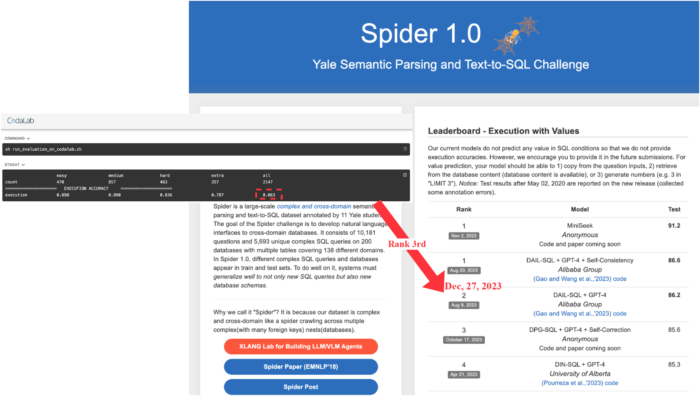

# Benchmark for Chat2Query

- [Spider Benchmark](./benchmark_spider/README.md)
- [Bird Benchmark](./benchmark_bird/README.md)

## Benchmark Report

### Spider



### Bird


## Citation

Feel free to cite us if you like this project of Chat2Query V1.

```bibtex
@inproceedings{zhu2024chat2query,
  title={Chat2Query: A Zero-Shot Automatic Exploratory Data Analysis System with Large Language Models},
  author={Zhu, Jun-Peng and Cai, Peng and Niu, Boyan and Ni, Zheming and Xu, Kai and Huang, Jiajun and Wan, Jianwei and Ma, Shengbo and Wang, Bing and Zhang, Donghui and others},
  booktitle={2024 IEEE 40th International Conference on Data Engineering (ICDE)},
  pages={5429--5432},
  year={2024},
  organization={IEEE}
}
```

We will release the Chat2Query V2 paper at a later date.