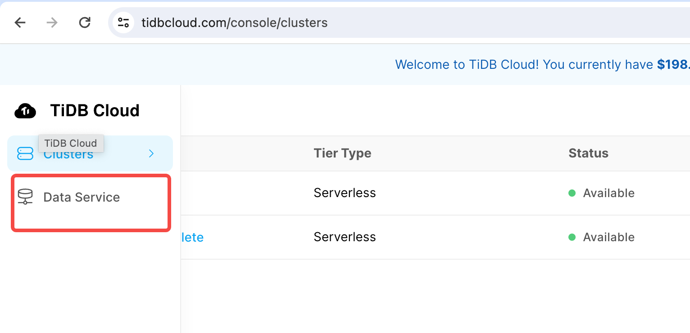

# Bird for Chat2Query

Dev dataset score is 58.15.

Below are the steps to run bird evaluation

## Step 1: Create a new Chat2Query App in TiDBCloud

You have to login in [TiDBCloud](https://tidbcloud.com), and create a Chat2Query DataApp.




Save the Base URL, we'll use it in step 5.

## Step 2: Create Chat2Query API Key


Save the public key and private key, we'll use it in step 5.

## Step 3: Clone the repository and install dependencies

```bash
$ git clone https://github.com/tidbcloud/chat2query_bench
$ cd chat2query_bench/benchmark_bird
$ pip install -r requirements.txt
```

Download the bird dataset: https://bird-bench.oss-cn-beijing.aliyuncs.com/dev.zip
unzip it in the `benchmark_bird/data` folder, and make sure the folder name is `data`, not `dev`.

File structures should like:

```bash
$ tree -L 1 data/
data/
├── dev_databases
├── dev_gold.sql
└── dev.json

2 directories, 2 files
```

## Step 4(Optional): Customize the bird evaluation parameters

> **NOTE** By default, we will run the bird evaluation with GPT-3.5 model. If you want to use GPT-4 model,
> you need to provide your org_id to us, and we will enable `settings` api for you. You can do this by
> sending an email to `chat2query@pingcap.com`.

You can customize the bird evaluation parameters by calling `settings` API, for example:

```bash
export PUBLIC_KEY="<Your Public Key>"
export PRIVATE_KEY="<Your Private Key>"
export BASE_URL="<Your data app endpoint url>"

curl --digest --user ${PUBLIC_KEY}:${PRIVATE_KEY} --request PUT ${BASE_URL}\
 --header 'content-type: application/json' \
 --data-raw '{
    "openai_api_key": "<Your Secret OpenAI API Key>",
    "language": "English",
    "ai_model": "gpt-4"
 }'
```

## Step 5: Edit the `runbird.sh` script

Replace or paste the BASE_URL, PUBLIC_KEY, PRIVATE_KEY variables in `runbird.sh`

## Step 6: Run the script to generate sql and run evaluation

> If you want to run the evaluation with GPT-4 model, make sure you've send the OpenAI API Key and Public Key to us and
> after we've enabled GPT-4 model for you, you can run the script.

```bash
$./runbird.sh
```
