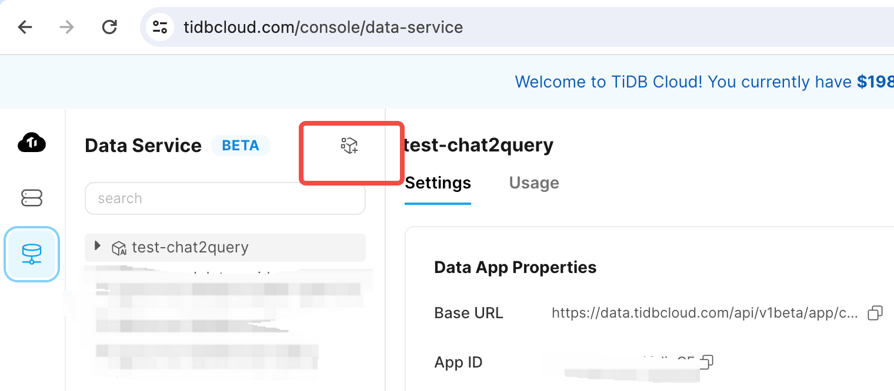

# Spider for Chat2Query

The spider evaluation benchmark of PingCAP Chat2Query program is 86.3, here is codalab link of the benchmark:

https://worksheets.codalab.org/worksheets/0xeaa16ad377f14a21aa8edbed90e49233
https://worksheets.codalab.org/bundles/0xe1fe59dd2177413b83b958f108ee9693

Below are the steps to reproduce the score.

## Step 1: Create a new Chat2Query App in TiDBCloud

You have to login in [TiDBCloud](https://tidbcloud.com), and create a Chat2Query DataApp.





Save the Base URL, we'll use it in step 5.

## Step 2: Create Chat2Query API Key


Save the public key and private key, we'll use it in step 5.

## Step 3: Clone the repository

```bash
$ git clone https://github.com/tidbcloud/tiinsight
$ cd tiinsight/chat2query_benchmark
$ cd spider
```

Download the spider dataset: https://drive.usercontent.google.com/download?id=1403EGqzIDoHMdQF4c9Bkyl7dZLZ5Wt6J&export=download&authuser=0
Unzip the file and copy the `test.json` and `test_gold.sql` files, as well as the entire `test_database` directory, into the `data` directory located within the `spider` directory.

File structures should like:

```bash
$ tree -L 1 data/
data/
├── test_database
├── test_gold.sql
└── test.json

1 directories, 2 files
```


## Step 4: Build the container

Build the container by the following command:

```bash
$ docker build -f ./Dockerfile.base . -t spider_chat2query:base
$ docker build . -t spider_chat2query
```

## Step 5: Generate SQL

Edit the `gensql.sh` file and paste `PUBLIC_KEY`, `PRIVATE_KEY`, `BASE_URL`
variables, then run the script.
<!-- -->
**NOTE**: By default, you're running the benchmark in `gpt-4o-mini`, to reproduce the best running results,
please [contact us](mailto:tiinsight@pingcap.com) to upgrade your app settings by using `gpt-4`.

```bash
$./gensql.sh
```

## Step 6: Run spider eval program

```bash
$./evaluation.sh
```
