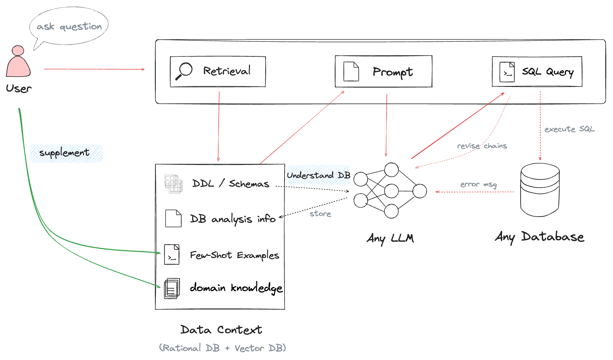
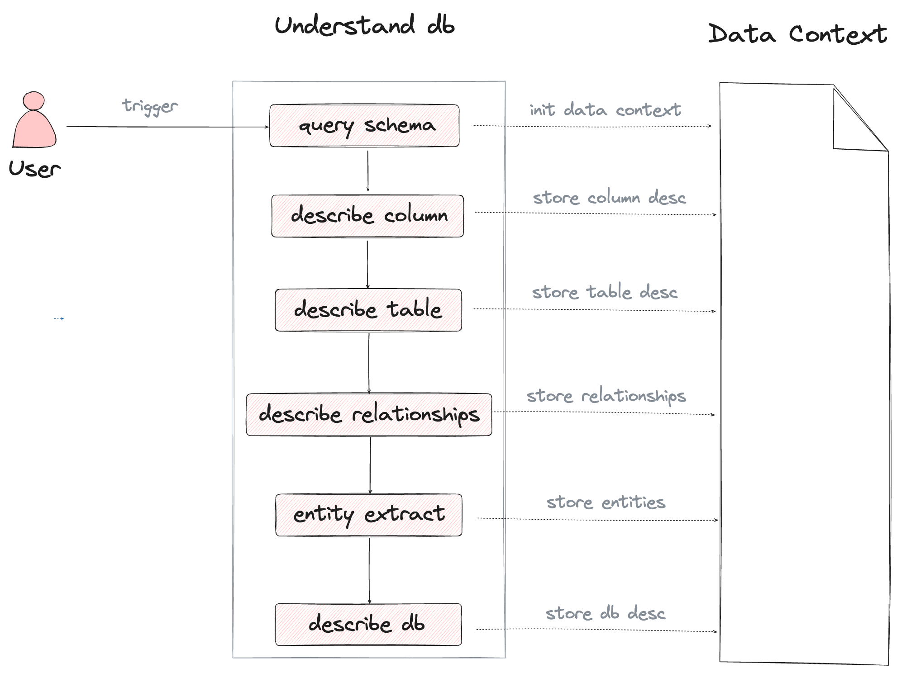
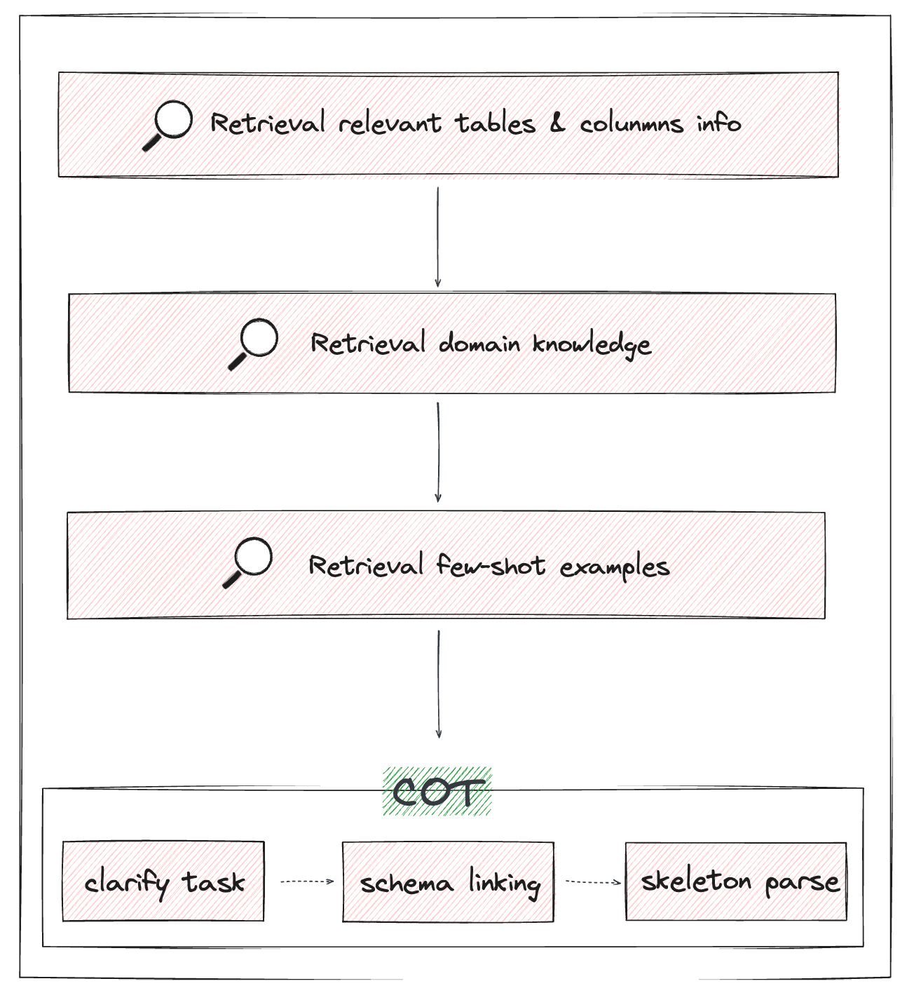
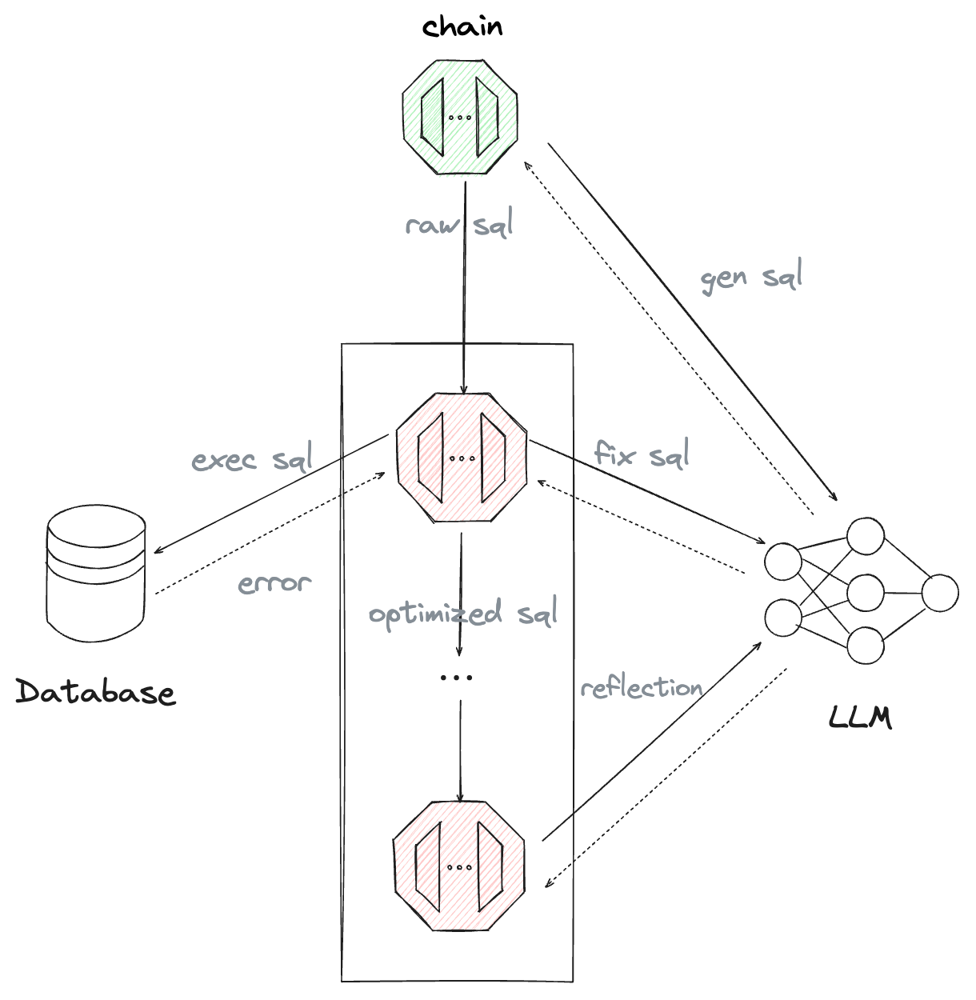

# Chat2Query: The Secret Behind Its Success

As a tool that significantly lowers the hurdles to data exploration,  Text2SQL is the most crucial feature for Chat2Query, and is also essential for other AI for BI products. In this blog, we will delve deeper into the workings of this feature and shed light on the reasons behind its success.

## How Chat2Query Work
Chat2Query operates in two simple steps as shown in the diagram below: enriching the data context and then asking questions.

The data context is stored using both relational and vector databases. To enrich the data context, we have two key tasks. The first task is to start the 'Understand db' process, which is designed to uncover concealed details about the descriptions of tables and columns, the relationships between different tables, and the primary entities. The second task is to supplement knowledge,  such as few-shot examples, term-sheet explanations, among others. While these two tasks are not mandatory, they significantly improve the subsequent SQL generation.

## Why Chat2Query Success
To enhance the accuracy of SQL generation, we have made numerous optimizations, which can primarily be attributed to the following three aspects:

### Understand db
As previously mentioned, "Understand db" primarily utilizes LLM to analyze DDL schemas. This process involves generating descriptions for tables and columns, inferring relationships between tables, and extracting key entity information from the schema. Our tests on the Spider benchmark show that using "Understand db" makes our work about **2% to 3% more accurate than not using it**.

### Prompt Engineering
Prompt Engineering is another factor for achieving success. We experimented with a variety of Prompt Engineering techniques and ultimately improved the accuracy of SQL generation significantly by combining COT(Chain of Thought) and RAG(Retrieval Augmented Generation). In contrast to the simple use of "Let's think step by step", our COT is artificially designed based on what we learned from other research. Whether tested under the Spider benchmark or the Bird benchmark, **it has consistently delivered excellent results**. The primary steps involved in Prompt Engineering are outlined below.

### Post-Processing

Sometimes, the oversight or hallucination of LLM can lead to instability in output or poor performance. To rectify this, we've introduced additional post-processing chains to refine the raw SQL generated by LLM, with the goal of enhancing the final SQL accuracy rate. It's important to note that these post-processing chains are optional and can be added or removed based on user preference.

Our testing on the Bird and Spider benchmarks has shown that incorporating these post-processing procedures can boost the overall accuracy rate **by 2% to 4%**. The entire process, which closely resembles a multi-agent collaboration mechanism, is outlined below:

## Conclusion
Although Chat2Query has made some progress in Text2SQL, it is still evolving. We are continuously exploring various new optimization methods to enhance its performance. Please stay tuned for more updates and improvements.