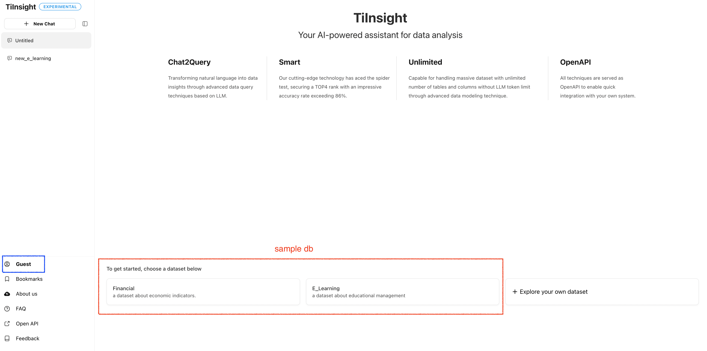
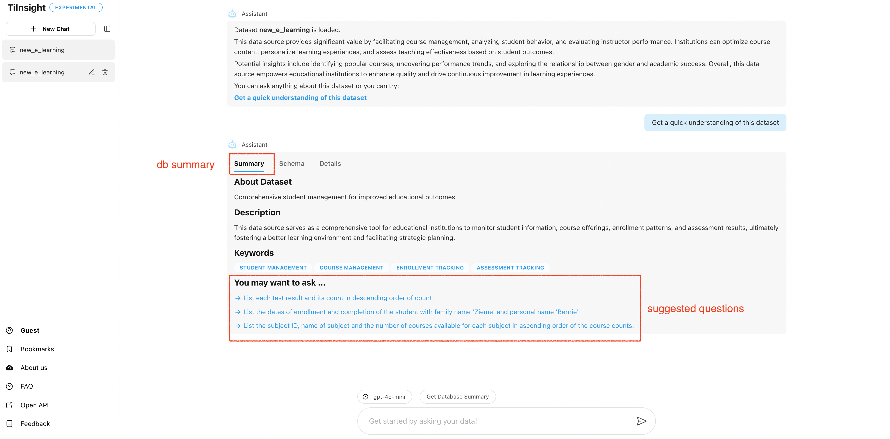
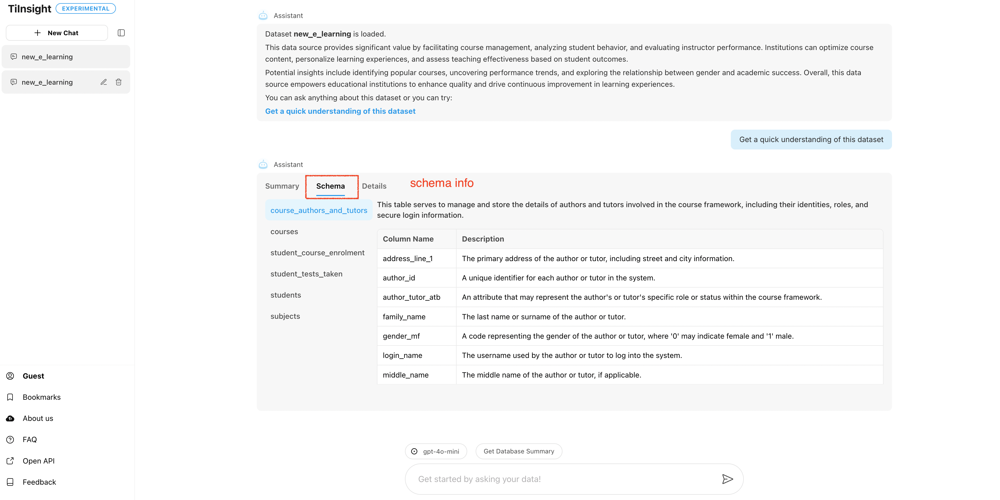
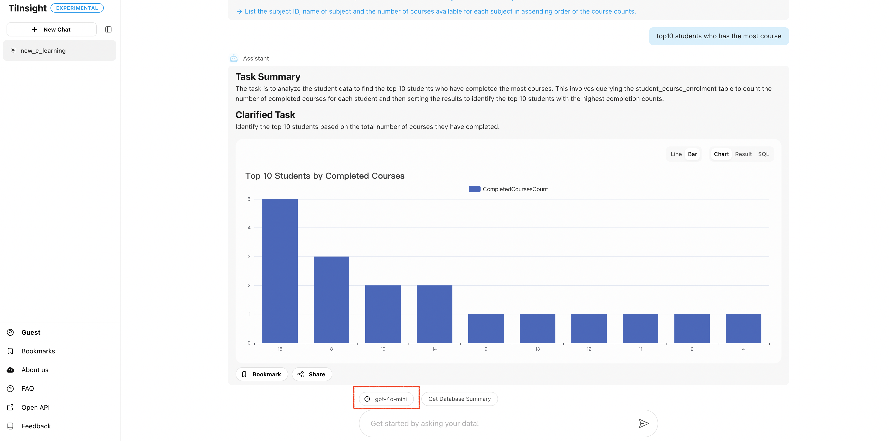
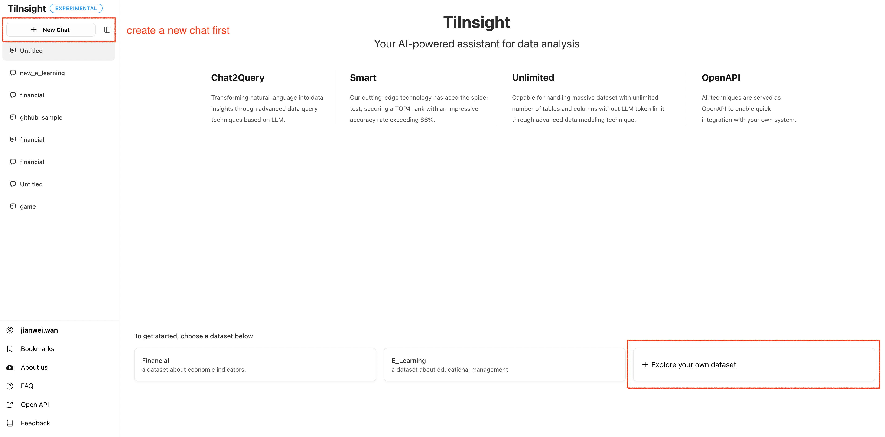
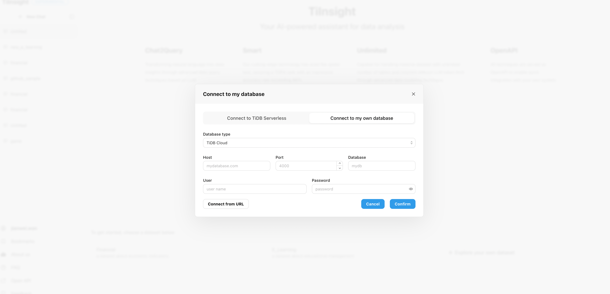
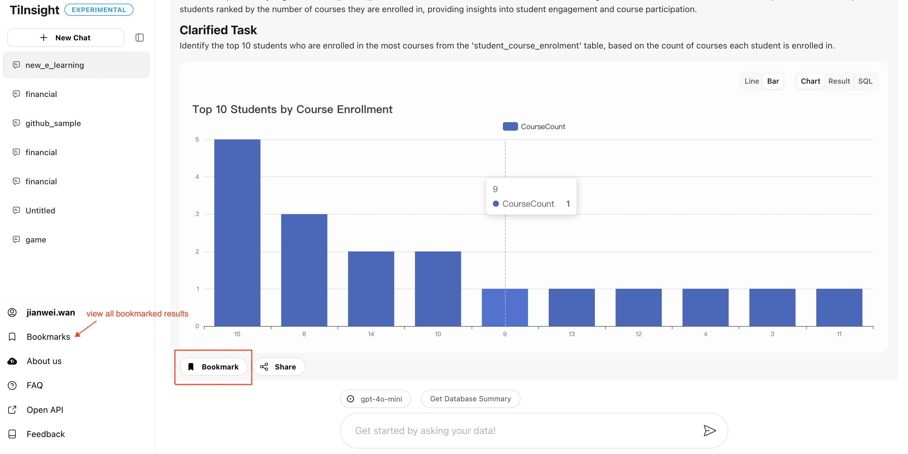
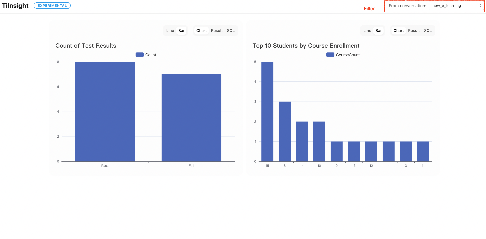
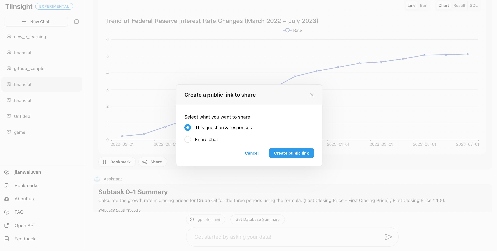

[TiInsight](https://www.tiinsight.chat/) offers user login functionality. There are some differences in feature access between logged-in and non-logged-in users.

## Non-Logged-In
When you first open TiInsight, you're in 'Guest' mode and not logged in, which limits access to some features. To help you explore, we offer two sample datasets. You can choose either one to try out.

Once you select a database to use, the first step is to quickly understand the dataset. TiInsight will display some results to help you grasp the features of the current database. This mainly includes:
1. An overall description of the database
2. Schema information

Additionally, TiInsight will suggest **related questions** to help you get started quickly.

After that, you can enter your questions, and TiInsight will provide answers. Please note that for non-logged-in users, only the `gpt-4o-mini` model is available by default.

## Logged-In
To log in, users need to first register for a [Tidb Cloud](https://tidbcloud.com/) account. Once logged in, you'll unlock the following features:

### Explore Your Own Dataset
Currently, Tiinsight supports connecting to MySQL databases as well as databases created in TiDB Cloud.

|||
|------------------|------------------|

### Bookmark And Share
For logged-in users, you can bookmark previous answers from Tiinsight and compile them into a dashboard. This allows you to easily access and organize important information, track insights over time, and quickly reference past queries for more efficient decision-making.

|||
|------------------|------------------|

Additionally, you can share your Tiinsight results with others, which facilitates collaboration, enables team members to stay informed, and helps in collectively analyzing and interpreting data insights.

### Model Selection
For logged-in users, we offer the additional option to use the `gpt-4o` model for generating results. Compared to `gpt-4o-mini`, `gpt-4o` provides better performance and more effectively showcases TiInsight's capabilities. In the future, we may introduce more model options.

**Please note**: Currently, each user is limited to 100 free calls per day.

## Share Your Feedback
We are committed to improving TiInsight and welcome your suggestions. Please share your feedback with us at [tiinsight@pingcap.com](mailto:tiinsight@pingcap.com). Thank you for helping us enhance our service!
